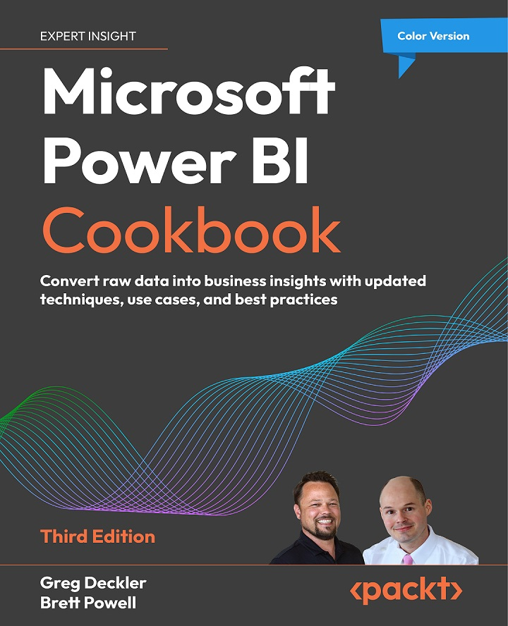

# Microsoft Power BI Cookbook, Third Edition

A practical, recipe-based approach provides solutions to real-world data challenges, enhancing your analytical skills and understanding of Power BI

## Key Features
- Dive into Microsoft Data Fabric for deeper insights and robust data strategies  
- Implement Hybrid tables, create comprehensive scorecards, and establish shared cloud connections effortlessly  
- Uncover new and updated data visualization tools that turn complex data into clear, actionable charts and reports

## Book Description
Since its first edition the *Power BI Cookbook* has been a best-selling resource for BI developers and data analysts to produce impactful, quality BI solutions. This new and updated edition retains the rigorous details and concepts readers of prior editions have enjoyed while also demonstrating powerful new capabilities and updated guidance aligned to the current state of the platform.  

In this book, with step-by-step instructions, you will learn to navigate the complexities of data integration and visualization in Power BI. From creating robust data models to implementing sophisticated reporting techniques, this Power BI book empowers you to make informed decisions based on actionable insights. It also introduces you to new capabilities such as Hybrid tables and scorecards, enhancing your ability to communicate and analyze business performance. It also expands and improvises on the core of the previous edition like parameterizing Power BI solutions, authoring reports, data intelligence, and integrating advanced analytics.  

This edition not only updates you on the latest features but also prepares you for future innovations with a preview of upcoming AI enhancements in Power BI. Whether you're refining your skills or aspiring to become an expert, this book is an invaluable resource for leveraging Power BI to its fullest potential.

## What you will learn
- Analyze and integrate business data using Microsoft Data Fabric  
- Create impactful visualizations and manage Hybrid tables  
- Develop shared cloud connections and advanced scorecards  
- Enhance report accuracy and dynamics using real-time data processing  
- Implement efficient data governance and security measures within Power BI

## Who This Book Is For
This book is designed for data analysts, business intelligence professionals, and anyone involved in data processing or analytics who seeks to enhance their skills with Power BI’s latest features and prepare for future advancements in the field.

## Table of Contents

 1. Installing and Licensing Power BI Tools
 2. Accessing, Retrieving, and Transforming Data
 3. Building a Power BI Semantic Model
 4. Authoring Power BI Reports
 5. Working in the Power BI Service
 6. Getting Serious About Date Intelligence
 7. Parameterizing Power BI Solutions
 8. Implementing Dynamic User-Based Visibility in Power BI
 9. Applying Advanced Analytics and Custom Visuals
 10. Enhancing and Optimizing Existing Power BI Solutions
 11. Deploying and Distributing Power BI Content
 12. Integrating Power BI with Other Applications
 13. Working with Premium and Microsoft Fabric
 14. Administering and Governing Power BI (*Online chapter*)
